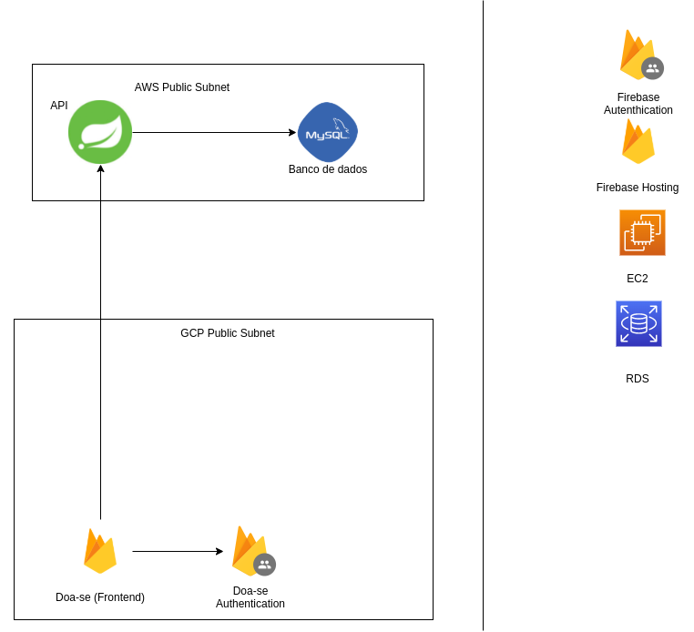

# Doa-se

## Objetivo

Nosso trabalho tem como objetivo facilitar a inclusão de doações, sejam elas feitas por ongs ou doadores. Categorizando as mesmas e permitindo comunicação entre a ONG e nossa plataforma

## Tecnologias

| Tecnologias | Versão |
|-------------|--------|
|Java         | 8      |
|Spring Boot  | 2.1.6  |
|Vanilla JS   |        |
| Bootstrap   |  5.1   |
| Scss        | 1.43.4 |
| Mysql(RDS)  |        |
| EC2         | Ubuntu  20.04  |
| Fireabse API AUth    | 8.3.0 |
| Firehosting          | 8.3.0 |

## Arquitetura

## Funcionalidades

## 🤝 Colaboradores

Agradecemos às seguintes pessoas que contribuíram para este projeto:

<table>
  <tr>
    <td align="center">
      <a href="https://github.com/Gabryel8818">
         
        
          <b>Gabriel Nascimento</b>
        
      </a>
    </td>
        <td align="center">
      <a href="https://github.com/gabrielsm14">
         
        
          <b>Gabriel Mendonça</b>
        
      </a>
    </td>
      <td align="center">
      <a href="https://github.com/Wes-Ley-Cor-Ean-O39">
         
        
          <b>Wesley Azevedo</b>
        
      </a>
    </td>
<td align="center">
      <a href="https://github.com/joao1713">
         
        
          <b>Joao</b>
        
      </a>
    </td>
    
  </tr>
</table>
